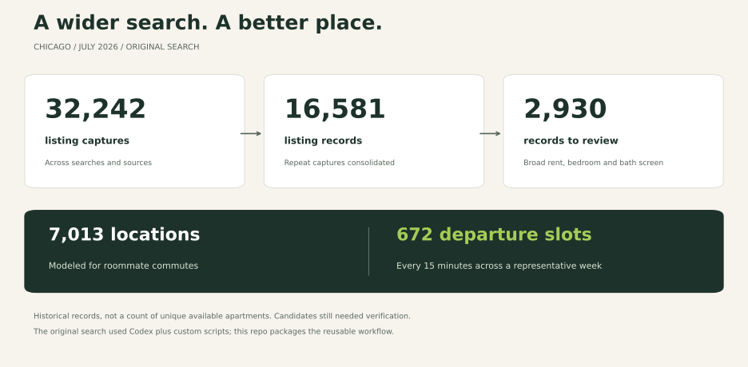

# Goldblum

*Life, uh, finds a lease.*

**An open-source take on Apartments.com. Search across rental sites and filter by commute time, rent, space, bathrooms, and more.**

Built this while apartment hunting in Chicago. Manual browsing was slow, & every apartment had trade-offs (too expensive, too few bathrooms, long commute, etc.). Built scripts to collect apartment listings across Chicago, calculate each roommate’s commute to work, and filter the results.  

This repo turns that work into tools other people can use.



Historical captures include repeats; the records are not all unique, available apartments. The 2,930 were a broad review pool. [Numbers and methods](docs/CASE-STUDY.md).

## Search beyond one site

Compare listings from property managers and rental sites in one place. Browser recipes cover **Domu, Compass, Apartments.com, Zillow, Apartment List, RentCafe, and Baird & Warner**. Codex or Claude Code can collect whole pages and resume where the search stops.

Filter by rent, bedrooms, bathrooms, square footage, pets, parking, and move-in date. Keep missing facts visible. Explore the map, shortlist places, track price changes, and export CSV or JSON.

## Compare everyone's commute

A place farther away can still get you to work faster. Enter each roommate's destinations, schedule, travel modes, and commute limit. R5 uses OpenStreetMap and transit schedules to calculate walking, cycling, and bus/train trips—including the walk at each end.

The household algorithm compares outbound and return routes, selects the fastest valid round trip within each person's commute cap when possible, and totals weekly travel time. Saved routes are reused.

Driving estimates exclude rush-hour traffic. Routing needs the optional R/Java setup; [setup and algorithm details](docs/ROUTING.md).

## Run your search

With Python 3.11+ and [uv](https://docs.astral.sh/uv/getting-started/installation/):

```sh
uv tool install git+https://github.com/riddlejack/goldblum
goldblum start --city Chicago
```

Open **http://127.0.0.1:8765**, enter your requirements, and collect. Automatic sources refresh with `goldblum refresh`, without AI usage. Your data and destinations stay in your local `.goldblum/` folder.

For browser sources, open a clone of this repo in Codex or Claude Code and ask:

> Use collect-browser to search for my saved preferences. Import batches, check promising listings, and save where you stop.

Upgrading from Room & Route? Add `--force` to the install command above. Existing `.housing/` searches are detected automatically, and the `housing` command still works.

Chicago has the maintained source catalog. Other cities can reuse the collectors and browser recipes with local sources added. Coverage has gaps; this cannot guarantee every listing. [Browser workflow](docs/BROWSER-COLLECTION.md) · [Source coverage](docs/COLLECTION.md) · [Agent instructions](AGENTS.md)

<details>
<summary>Try the demo or develop locally</summary>

```sh
goldblum --workspace demo-search demo
goldblum --workspace demo-search review

git clone https://github.com/riddlejack/goldblum.git
cd goldblum
uv sync --locked
uv run pytest
```

The demo needs no routing setup. [Architecture](docs/ARCHITECTURE.md).

</details>

Code: MIT. Listings, maps, and transit feeds retain their source terms. Keep private workspaces out of Git; `.goldblum/` and legacy `.housing/` are ignored by default.
